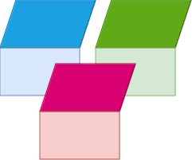
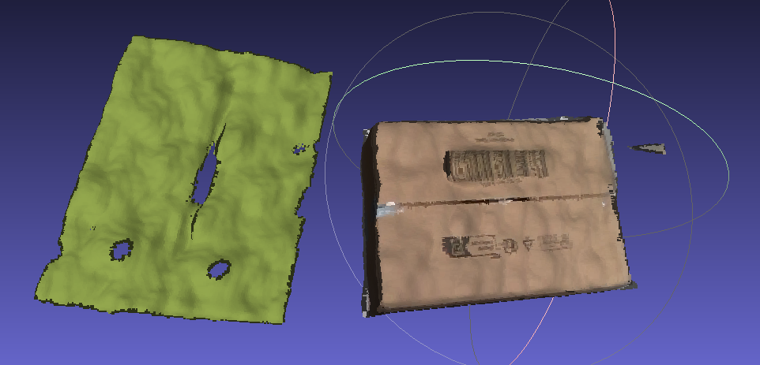
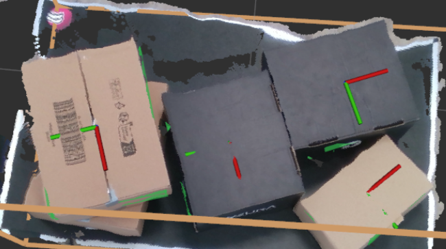

# smart_palletizer

[[_TOC_]]

## Introduction

Welcome to the [NEURA robotics](https://neura-robotics.com) Smart Palletizer challenge, the goal of this challenge is to assess your knowledge regarding various software development topics.

## Instructions

You are free to use **Python or C++**, preferably with Robotics Operating System ([**ROS**](https://www.ros.org)) either ROS1 or ROS2.

Please explain your **methodology** into solving the challenging tasks either via updating this readme file or via creating a separate Markdown file. 

> Please note that using [ChatGPT](https://chatgpt.com) is OK as long as you understand what you copy from there!.

## Tasks

Tasks have various complexity, optimal thing is to solve them all, however if you didn't solve some tasks please submit your code.

> Tasks are not interdependent.

### Input 


Data are provided in two formats:
1. ROSBAG:

    If you use **ROS**, please download and use the [ROS bag](https://drive.google.com/file/d/1ldM94Tz_I5NytLaQB8AydF_pxDG7EOkd/view?usp=sharing) which contains data needed to achieve the task.
2. RAW data:

    the [data](./data/) folder, there you can find two types of boxes:
    1. **small box**: dimensions: [0.340, 0.250, 0.095] in meters.
    2. **medium box**: dimensions: [0.255, 0.155, 0.100] in meters (only one box in the left bottom corner is visible).

    Provided data includes color/depth images in addition to box meshes, and other forms of data that is useful to solve the tasks.


### 1. 2D boxes detection

---

The goal of this task is to detect and small box, and medium box from color/depth images:

Note that you are free to use classical detection methods, or even [**synthetic**](https://github.com/DLR-RM/BlenderProc) data generated using the provided mesh files to achieve this task.

Here is an example of detected medium box:


### 2. Planar patches detection (3D)

---

The goal of this task is to detect planar surfaces in the point cloud of the boxes that might represent any of box sides and group them according to the box that they belong to.



### 3. Point Cloud post processing

---

Raw Point Clouds provided in the data folder are noisy, the goal of this task is to post-process the pointcloud to get a clean pointcloud for further processing, without jeopardizing the dimensions of the box too much.



### 4. Boxe Poses Estimation

---

This task aims to estimate 6D poses (Translation, Orientation) of the boxes in the scene:



## Evaluation

1. **Methodology** correctness into solving the challenge, please explain your efforts into solving the challenge rather than sending code only.
1. **Code validity** your code for the submitted tasks has to compile on our machines, hence we ask you kindly to provide clear instructions on how to compile/run your code, please don't forget to mention depndency packages with their versions to reproduce your steps.
3. **Code Quality** we provide empty templates e.g. `.gitignore`, `docker`, `CI`, Documentation, they are **optional**, keep in mind that best practices are appreciated and can add **extra points** to your submission.
4. **Visualization** it would be nice if you can provide visual results of what you have done: images, videos, statistics to represent your results.
5. **ChatGPT / Gemini** are useful tools if you use them wisely, however original work / ideas are always regarded with higher appreciation and gain more points, we remind you that we might fail the challenge if you misuse them (*e.g. copy paste code without understanding*).

## Documentation

Documenting your code is appreciated as you can explain the functionality in standardized way, hence we provide you with a Python template to compile your [documented functions/classes](https://www.geeksforgeeks.org/python-docstrings):

```sh
sudo apt-get install texlive-latex-base texlive-fonts-recommended texlive-fonts-extra texlive-latex-extra latexmk
#
cd smart_palletizer/docs
pip3 install -U pip
pip3 install -r requirements.txt
make clean && sphinx-apidoc -f -o source ../src/smart_palletizer
make html SPHINXBUILD="python3 <path_to_sphinx>/sphinx-build"
##----------
## Example:
##----------
# make html SPHINXBUILD="python3 $HOME/venv/bin/sphinx-build"
```
---

If you are using C++, then please refer to [Doxygen](https://www.doxygen.nl)
